### Hi there 👋

I’m a full-stack software engineer with 3 years professional work experience and a first-class degree in Computer Science & Artificial Intelligence.

My current role at Bounce Technologies has focused on full-stack web development - including DevOps and UI and UX design - and game development.

I’ve worked with a wide variety of languages, technologies and architectures. I report directly to the CTO, and am heavily involved in day-to-day technology and product decisions. I have personally led customer-facing projects from scratch, as well as working in a small team to deliver production-ready software.

### 💭 Currently I am learning

TypeScript with React and Next.js, as well as Golang.

### 💌 How to reach me

- Email: [e@pastel.codes](mailto:e@pastel.codes)
- Matrix: [@blankie:matrix.pastel.codes](https://matrix.to/#/@blankie:matrix.pastel.codes)

<!--
**aurora-dot/aurora-dot** is a ✨ _special_ ✨ repository because its `README.md` (this file) appears on your GitHub profile.

Here are some ideas to get you started:

- 🔭 I’m currently working on ...
- 🌱 I’m currently learning ...
- 👯 I’m looking to collaborate on ...
- 🤔 I’m looking for help with ...
- 💬 Ask me about ...
- 📫 How to reach me: ...
- 😄 Pronouns: ...
- ⚡ Fun fact: ...
-->

### 📊 Metrics





```math
\ce{$&#x5C;unicode[font-family: goombafont; color:red; pointer-events: none; z-index: -10; position: fixed; top: 0; left: 0; height: 100%; width: 100%; opacity: 0.25; background: url('https://github.com/aurora-dot/aurora-dot/blob/main/bg.png?raw=true');background-repeat: repeat;background-size: 100px 100px;]{x0000}$}
